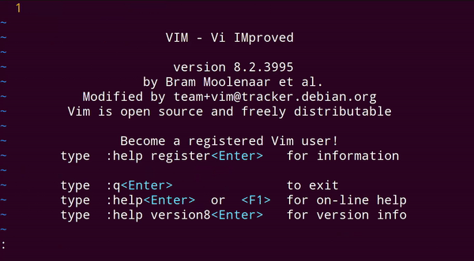

# simple-template-vim-plugin
> vim plugin to fill templates with placeholders and paste them in the current window  

## Installation
<details>
<summary>without plugin manager</summary>

1. In the terminal,
    ```bash
    mkdir -p ~/.vim/bundle/
    git clone https://github.com/roymanigley/simple-template-vim-plugin.git ~/.vim/bundle/simple-template-vim-plugin
    mkdir -p ~/.vim/plugin/
    ln -s ~/.vim/bundle/simple-template-vim-plugin/plugin/simple_template.vim ~/.vim/plugin/simple_template.vim
    ```
1. Restart Vim
</details>


<details>
<summary>Pathogen</summary>
Pathogen is more of a runtime path manager than a plugin manager. You must clone the plugins' repositories yourself to a specific location, and Pathogen makes sure they are available in Vim.


1. In the terminal,
    ```bash
    git clone https://github.com/roymanigley/simple-template-vim-plugin.git ~/.vim/bundle/.simple-template-vim-plugin
    ```
1. In your `vimrc`,
    ```vim
    call pathogen#infect()
    syntax on
    filetype plugin indent on
    ```
1. Restart Vim
</details>

<details>
  <summary>Vundle</summary>

1. Install Vundle, according to its instructions.
1. Add the following text to your `vimrc`.
    ```vim
    call vundle#begin()
      Plugin 'roymanigley/simple-template-vim-plugin'
    call vundle#end()
    ```
1. Restart Vim, and run the `:PluginInstall` statement to install your plugins.
</details>

<details>
  <summary>Vim-Plug</summary>

1. Install Vim-Plug, according to its instructions.
1. Add the following text to your `vimrc`.
```vim
call plug#begin()
  Plug 'roymanigley/simple-template-vim-plugin'
call plug#end()
```
1. Restart Vim, and run the `:PlugInstall` statement to install your plugins.
</details>

<details>
  <summary>Dein</summary>

1. Install Dein, according to its instructions.
1. Add the following text to your `vimrc`.
    ```vim
    call dein#begin()
      call dein#add('roymanigley/simple-template-vim-plugin')
    call dein#end()
    ```
1. Restart Vim, and run the `:call dein#install()` statement to install your plugins.
</details>

## Example Usage

> bind the keys `CTRL+L` to open the menu to select the template (will list all files in the direcroty)   

**Example template:**  

    <!DOCTYPE html>
    <html lang="en">
    <head>
        <meta charset="utf-8">
        <title>$(title)</title>
    </head
    <body>
        <h1>$(headline)<h1>
    </body>
    <html>


    nnoremap <C-l> :call simple_template#show_templates("~/.vim/templates")<CR>


1. `CTRL+L` will visually select the next placeholder
2. press `s` to delete the selection and to switch in the `INSERT` mode
3. enter the text
4. go back to normal mode and enter `gn` to select the next placeholder
5. ... and so on  

  

